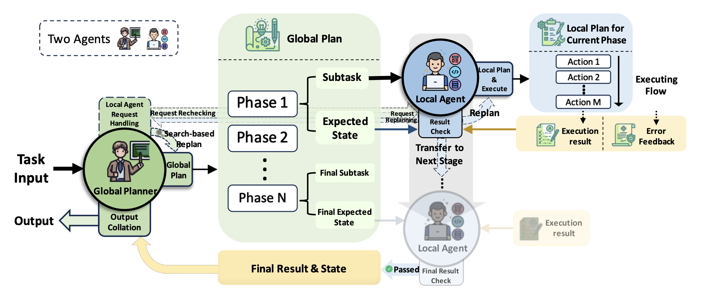
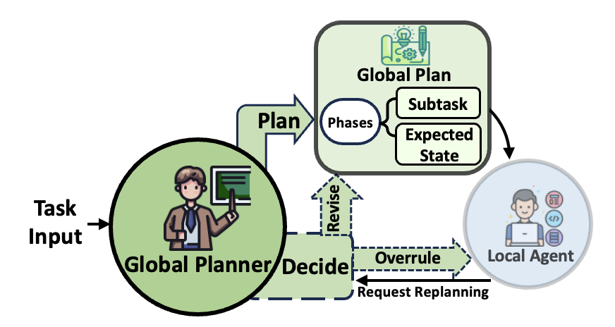
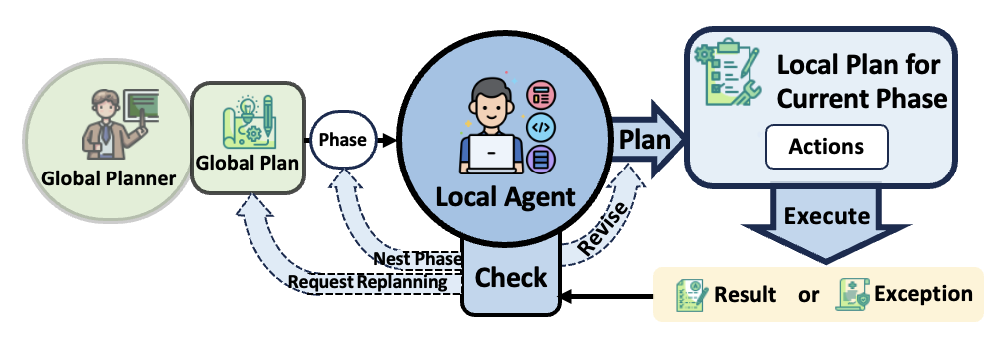
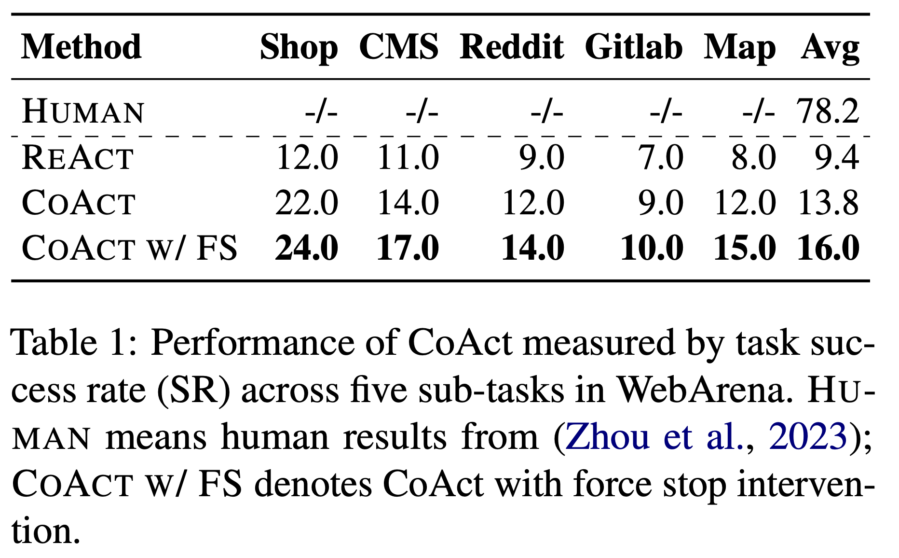
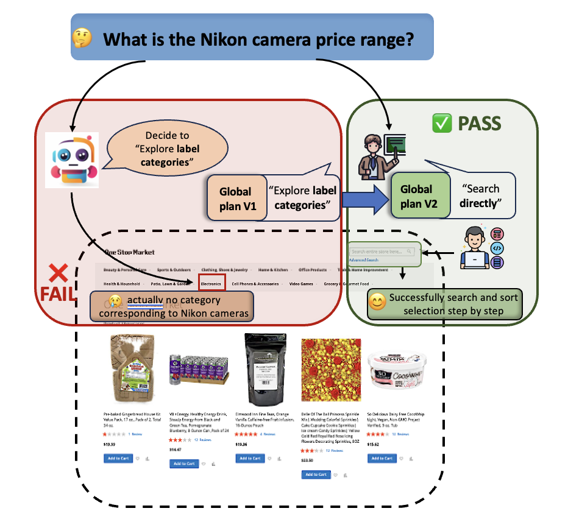
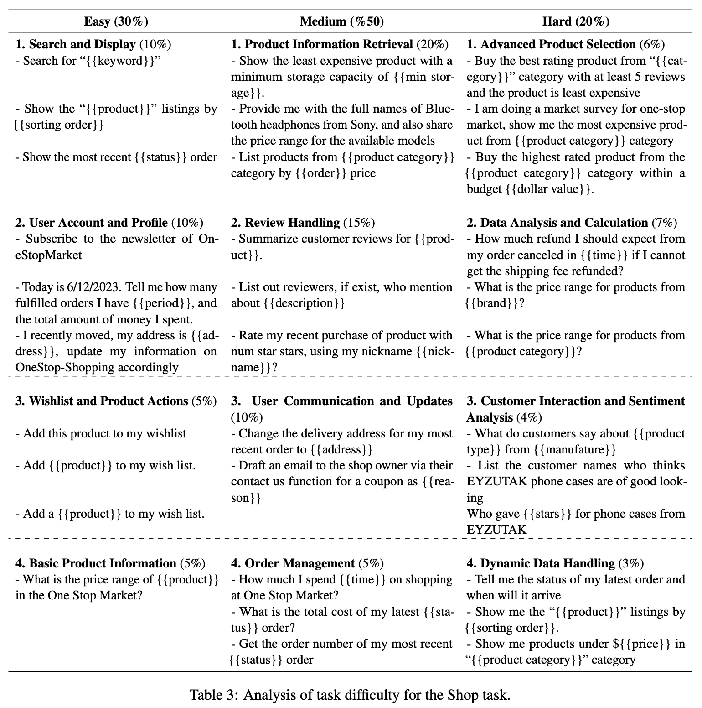

<h1 align="center">CoAct 👨🏻‍🏫👨🏻‍💻</h1>
Introducing CoAct, a hierarchical framework enhancing agent collaboration on complex real-world tasks.
<br>   <br>

## 👉 Paper
For more details, please refer to our paper [arxiv](https://arxiv.org/abs/2406.13381).


<div align="center">
  
</div>


## 🛠️ Usage

### 🧑🏻‍🔧Installation
To set up the environment, follow these steps:
```
# Python 3.10+
conda create -n webarena python=3.10
conda activate webarena
pip install -r requirements.txt
playwright install
pip install -e .

# Optional, for development purposes only
pip install -e ".[dev]"
mypy --install-types --non-interactive browser_env agents evaluation_harness
pip install pre-commit
pre-commit install
```

### 🔧 Preparation
Follow the Docker setup instructions provided at [webarena/environment_docker](https://github.com/web-arena-x/webarena/tree/main/environment_docker) and the preceding instructions available at [webarena](https://github.com/web-arena-x/webarena).

### ⚙️ Running CoAct
To run an example, use the following command:
```
python3 test_plan.py \
 --test_start_idx 0 \
 --test_end_idx 3 \
 --model gpt-3.5-turbo \
 --result_dir Results \
 --sleep_after_execution 2.5 \
 --render True \
 --render_screenshot True \
 --save_trace_enabled True
```

####  Argument Specification

1. `--test_start_idx`: Specifies the start index for test files.
2. `--test_end_idx`: Specifies the end index for test files.
3. `--model`: Indicates the model name to use.
4. `--result_dir`: Directory where results will be stored.
5. `--sleep_after_execution`: Time to sleep after execution (in seconds).
6. `--render`: Enables rendering of outputs.
7. `--render_screenshot`: Enables rendering of screenshots.
8. `--save_trace_enabled`: Enables saving of execution traces.


## 💡Framework
<div style="display: flex; justify-content: center; align-items: center;">
  <div style="margin-left: 10px;">
    
  </div>
  <div style="margin-right: 10px;">
    
  </div>

</div>

In this work, we propose the CoAct framework, which transfers hierarchical planning and collaboration patterns from human society to LLM systems. Specifically, our CoAct framework involves two agents:

1. **Global Planning Agent**: comprehends the problem scope, formulates macro-level plans, and provides detailed sub-task descriptions to local execution agents, serving as the initial rendition of a global plan.
  
2. **Local Execution Agent**: operates within a multi-tier task execution structure, focusing on the detailed execution and implementation of specific tasks within the global plan.

Experimental results on the WebArena benchmark demonstrate that CoAct can reorganize the process trajectory in the face of failures and achieves superior performance over baseline methods on long-horizon web tasks.

## 📃Results
<div align="center">
  
</div>

### 🌰Case Study
<div align="center">
  
</div>

### 🔍+SEARCH ENGINE Results

In the global planning process, we introduced a search step using search engines and augmented the text with brief passages not exceeding 100 words.

<div align="center">
  
</div>

### 📝Task Analysis

We categorize the examples that cannot be addressed by both ReAct and our CoAct into the Hard class. For those examples that only require one-step processing, we categorize them into the Easy class. The rest of examples are categorized into Medium class.

<div align="center">
  
</div>


## Citation

If you find our work interesting and useful, please feel free to give us a star and cite us through:
```bibtex
@misc{hou2024coactgloballocalhierarchyautonomous,
      title={CoAct: A Global-Local Hierarchy for Autonomous Agent Collaboration}, 
      author={Xinming Hou and Mingming Yang and Wenxiang Jiao and Xing Wang and Zhaopeng Tu and Wayne Xin Zhao},
      year={2024},
      eprint={2406.13381},
      archivePrefix={arXiv},
      primaryClass={cs.CL},
      url={https://arxiv.org/abs/2406.13381}, 
}
```
